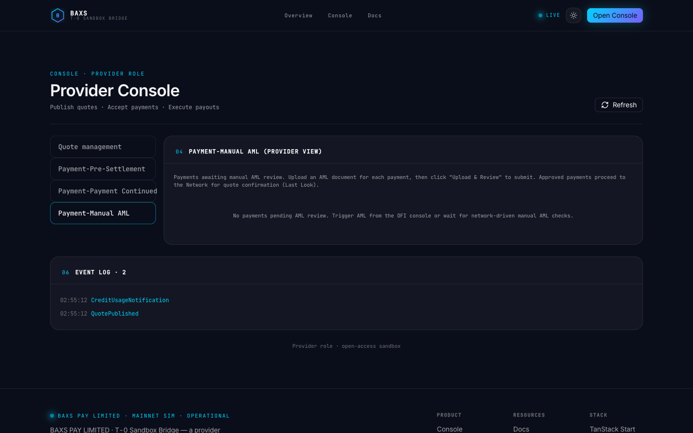

# Provider Manual AML E2E Test Report

**Date:** 2026-07-13T02:56:03.555Z

**Base URL:** http://127.0.0.1:8080

**Overall:** PASS ✓

---

## Test: provider-aml-panel

- **Path:** /provider
- **Status:** PASS
- **Duration:** 1650ms

### Checks

| # | Check | Status | Details |
|---|-------|--------|---------|
| 1 | page title | PASS ✓ |  |
| 2 | Payment-Manual AML tab exists | PASS ✓ |  |
| 3 | AML panel title visible | PASS ✓ |  |
| 4 | AML content rendered (empty state or upload UI) | PASS ✓ | {"emptyState":true,"fileInput":false} |
| 5 | Empty state text correct | PASS ✓ | {"text":"No payments pending AML review. Trigger AML from the OFI console or wait for network-driven manual AML checks."} |
| 6 | AML description paragraph visible | PASS ✓ |  |

### Screenshot

---

## Test Coverage

- Unit tests: 672 passed (37 files)
- E2E smoke: 4/4 passed
- E2E AML panel: PASS

