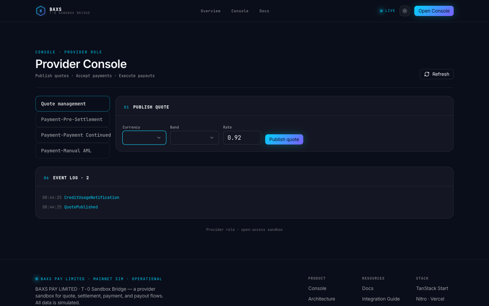

# Provider Currency / Band E2E Test Report

**Date:** 2026-07-12T08:50:20.461Z

**Base URL:** http://127.0.0.1:8080

**Overall:** FAIL ✗

---

## Test: provider-currency-band

- **Path:** /provider
- **Status:** FAIL
- **Duration:** 1158ms

### Checks

| # | Check | Status | Details |
|---|-------|--------|---------|
| 1 | page title | PASS ✓ |  |
| 2 | publish quote button | PASS ✓ |  |
| 3 | currency dropdown trigger | PASS ✓ |  |
| 4 | band dropdown trigger | PASS ✓ |  |
| 5 | currency listbox opened | FAIL ✗ |  |

### Error

```
Currency dropdown did not open after click
```

### Console Issues (1)

- [pageerror] Module "node:fs" has been externalized for browser compatibility. Cannot access "node:fs.existsSync" in client code.  See https://vite.dev/guide/troubleshooting.html#module-externalized-for-browser-compatibility for more details.

### Screenshot



---

## Expected Currency List (from SUPPORTED_CURRENCIES)

- **USD** — US Dollar (US)
- **EUR** — Euro (EU)
- **GBP** — Pound Sterling (GB)
- **JPY** — Japanese Yen (JP)
- **CHF** — Swiss Franc (CH)
- **CAD** — Canadian Dollar (CA)
- **AUD** — Australian Dollar (AU)
- **CNH** — Offshore Yuan (CN)
- **CNY** — Onshore Yuan (CN)
- **HKD** — Hong Kong Dollar (HK)
- **SGD** — Singapore Dollar (SG)
- **KRW** — South Korean Won (KR)
- **INR** — Indian Rupee (IN)
- **IDR** — Indonesian Rupiah (ID)
- **PHP** — Philippine Peso (PH)
- **THB** — Thai Baht (TH)
- **MYR** — Malaysian Ringgit (MY)
- **VND** — Vietnamese Dong (VN)
- **TWD** — Taiwan Dollar (TW)
- **AED** — UAE Dirham (AE)
- **SAR** — Saudi Riyal (SA)
- **ILS** — Israeli Shekel (IL)
- **TRY** — Turkish Lira (TR)
- **SEK** — Swedish Krona (SE)
- **NOK** — Norwegian Krone (NO)
- **DKK** — Danish Krone (DK)
- **PLN** — Polish Zloty (PL)
- **CZK** — Czech Koruna (CZ)
- **ZAR** — South African Rand (ZA)
- **EGP** — Egyptian Pound (EG)
- **NGN** — Nigerian Naira (NG)
- **KES** — Kenyan Shilling (KE)
- **BRL** — Brazilian Real (BR)
- **MXN** — Mexican Peso (MX)
- **ARS** — Argentine Peso (AR)
- **CLP** — Chilean Peso (CL)
- **COP** — Colombian Peso (CO)

## Expected Band List (from T-0 docs)

- $1,000
- $5,000
- $10,000
- $25,000
- $250,000
- $1,000,000

