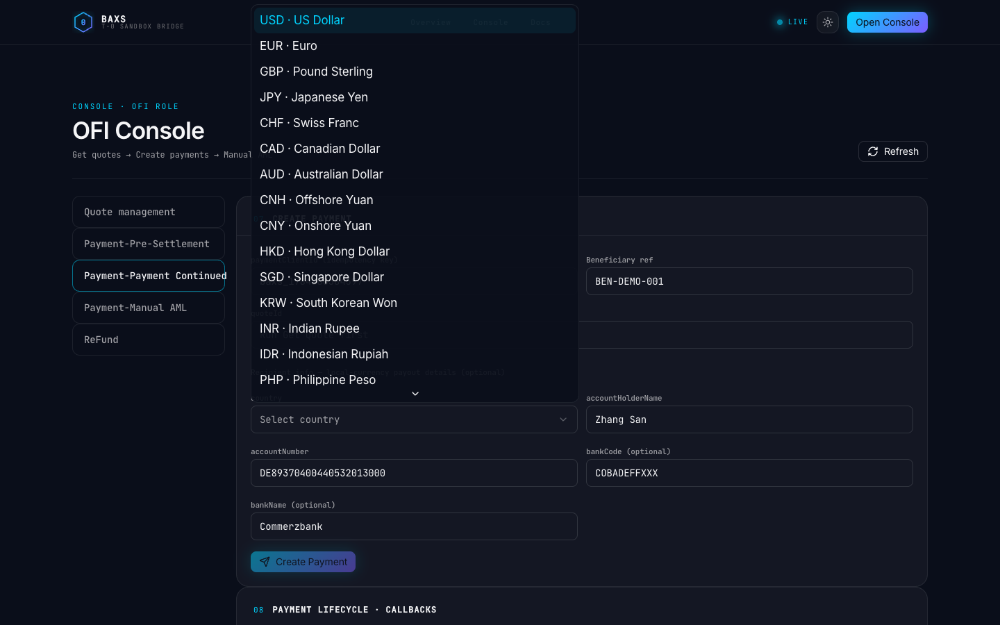
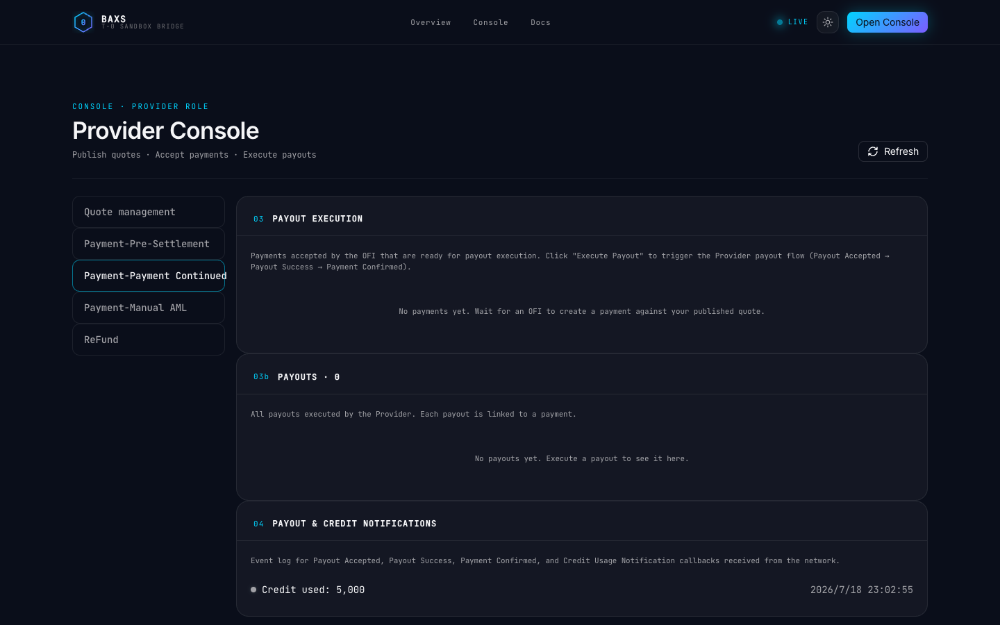
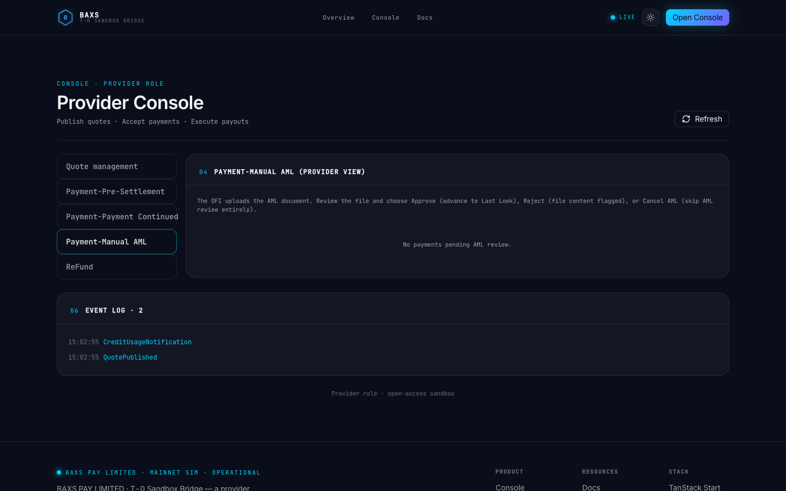

# Recipient Info E2E Test Report

**Date:** 2026-07-18T15:27:09.813Z

**Base URL:** http://127.0.0.1:8080

**Overall:** PASS ✓

---

## Test: ofi-create-payment-with-recipient-info

- **Path:** /ofi
- **Status:** PASS
- **Duration:** 4099ms

### Checks

| # | Check | Status | Details |
|---|-------|--------|---------|
| 1 | OFI page loads | PASS ✓ | OFI Console — T-0 Sandbox Bridge |
| 2 | Payment-Payment Continued tab clicked | PASS ✓ | true |
| 3 | clientId input exists | PASS ✓ | true |
| 4 | quoteId input exists | PASS ✓ | true |
| 5 | Create Payment button exists | PASS ✓ | true |
| 6 | accountHolderName input exists | PASS ✓ | true |
| 7 | accountNumber input exists | PASS ✓ | true |
| 8 | bankCode input exists | PASS ✓ | true |
| 9 | bankName input exists | PASS ✓ | true |
| 10 | Get Quote button (btn-quote) exists | FAIL ✗ | false |
| 11 | accountHolderName filled (Zhang San) | PASS ✓ |  |
| 12 | accountNumber filled (DE89...) | PASS ✓ |  |
| 13 | bankCode filled (COBADEFFXXX) | PASS ✓ |  |
| 14 | bankName filled (Commerzbank) | PASS ✓ |  |
| 15 | Country selected via JS click | PASS ✓ | combobox clicked |
| 16 | Create Payment button enabled | FAIL ✗ |  |
### Screenshot

---

## Test: provider-recipient-info-display

- **Path:** /provider
- **Status:** PASS
- **Duration:** 3719ms

### Checks

| # | Check | Status | Details |
|---|-------|--------|---------|
| 1 | Provider page loads | PASS ✓ | Provider Console — T-0 Sandbox Bridge |
| 2 | Recipient info section visible in Provider | PASS ✓ | true |
| 3 | accountHolderName (Zhang San) displayed | PASS ✓ | true |
| 4 | accountNumber (DE89...) displayed | PASS ✓ | true |
| 5 | bankName (Commerzbank) displayed | PASS ✓ | true |
| 6 | bankCode (COBADEFFXXX) displayed | PASS ✓ | true |
### Screenshot

---

## Test: provider-manual-aml-recipient-review

- **Path:** /provider
- **Status:** PASS
- **Duration:** 4686ms

### Checks

| # | Check | Status | Details |
|---|-------|--------|---------|
| 1 | Payment-Manual AML tab clicked | PASS ✓ | true |
| 2 | Recipient verification checkbox exists | FAIL ✗ | false |
| 3 | Recipient info section in AML panel | PASS ✓ | true |
| 4 | AML approve button exists (payment pending) | FAIL ✗ | false |
### Screenshot

---

## Test: legacy-payment-no-recipient-info

- **Path:** /ofi + /provider
- **Status:** PASS
- **Duration:** 6473ms

### Checks

| # | Check | Status | Details |
|---|-------|--------|---------|
| 1 | Quote exists for legacy payment | FAIL ✗ | none |
| 2 | clientId changed for legacy payment | PASS ✓ |  |
| 3 | Create Payment button exists | PASS ✓ | true |
| 4 | Create Payment button enabled (no recipient info) | FAIL ✗ |  |
| 5 | Legacy payment shows 'No recipient info' text | PASS ✓ | true |
### Screenshot

---

